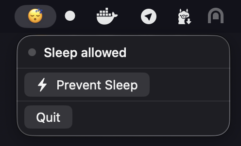
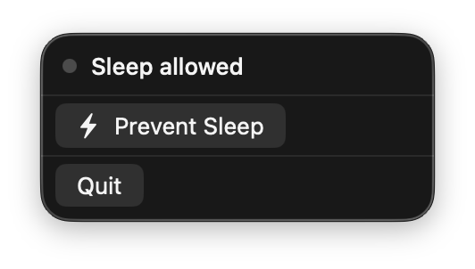
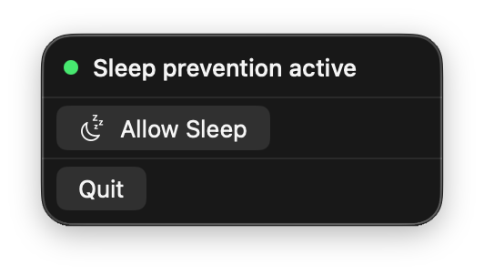

# Idler

A tiny macOS menu bar app that keeps your Mac awake. One click to prevent sleep — no more interrupted downloads, builds, or long-running processes.

<p align="center">
  
  &nbsp;&nbsp;
  
  &nbsp;&nbsp;
  
</p>

## Why?

Your Mac goes to sleep at the worst times — during a deployment, a large download, a database migration, or when you just walked away for coffee while tests are running. Idler sits in your menu bar and prevents that with one click.

## How It Works

When activated, Idler:
1. Creates IOKit power assertions to prevent both **system sleep** and **display sleep**
2. Simulates user activity every 30 seconds
3. Performs imperceptible mouse nudges (1 pixel) to defeat idle detection

When deactivated, all assertions are released and your Mac sleeps normally.

## Features

- **One-click toggle** — `moon.zzz` / `bolt` icons right in the menu bar
- **Prevents both system and display sleep** via IOKit power management
- **Activity simulation** every 30 seconds — keeps Slack green too
- **No dock icon** — lives quietly in the menu bar
- **Native macOS** — SwiftUI, single binary (~300KB), zero dependencies

## Install

### Download

Grab the latest `Idler.dmg` from [Releases](https://github.com/alexrett/idler2/releases).

Signed and notarized with Apple Developer ID.

### Build from Source

```bash
git clone https://github.com/alexrett/idler2.git
cd idler2
swift build -c release
open .build/release/Idler
```

Universal binary (Intel + Apple Silicon):

```bash
swift build -c release --arch arm64 --arch x86_64
```

## Usage

1. Launch Idler — look for 🌙 in the menu bar
2. Click it → **Prevent Sleep** — icon changes to ⚡
3. Click again → **Allow Sleep** — back to 🌙
4. That's it

## Requirements

- macOS 13.0 (Ventura) or later
- Works on both Apple Silicon and Intel Macs

## License

MIT
